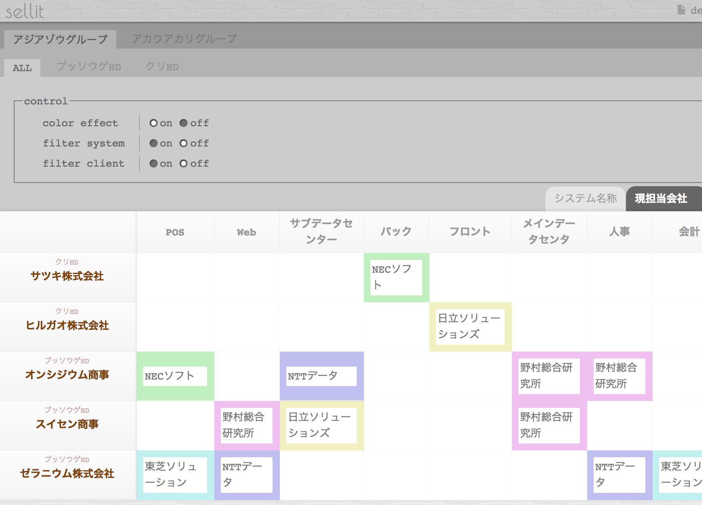

sellit
======

システム会社の営業向けのマチュアマップシステム。
顧客ごとに、どのシステムをどう導入しているかのマトリクス管理を行なう。




requirements
------
+ [Node.js](http://nodejs.org/)
+ [MongoDB](http://www.mongodb.org/)


quick start
------
```bash
    npm install
    node app.js
```

license
-------
This software is released under the [MIT License](https://raw.github.com/okunishinishi/sellit/master/LICENSE).

